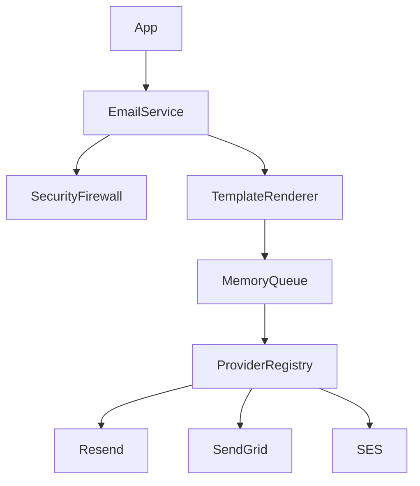

# Enterprise Email Module

A scalable, observable email module for Next.js applications built with Clean Architecture and Domain-Driven Design principles.

## Quick Start

```typescript
import { sendEmail, sendTemplateEmail } from "@/features/email";

// Send a raw email
await sendEmail({
  to: [{ email: "user@example.com", name: "User" }],
  subject: "Welcome!",
  text: "Hello there",
});

// Send a template email
await sendTemplateEmail(
  { to: [{ email: "user@example.com" }] },
  {
    name: "welcome",
    version: "v1",
    locale: "en",
    data: { name: "User" }
  }
);
```

## Features

- **Multi-Provider Support**: Resend, SendGrid, SES, SMTP with automatic failover
- **Template Engine**: Type-safe React Email templates with versioning
- **Queue System**: In-memory queue with rate limiting and retry logic
- **Security**: Disposable email blocking, unsubscribe header injection
- **Observability**: Structured JSON logging, event emitter for hooks

## Documentation

For in-depth understanding of the architecture and how to extend the module, see the documentation:

- [Email System Documentation](./docs/email-system/overview.md)

## Architecture Overview



## Related Modules

- [Auth System](./docs/auth-system/overview.md)
- [Notification System](./docs/notification-system/overview.md)
- [Rate Limiting](./docs/rate-limit-system/overview.md)
- [Cache](./docs/cache-system/overview.md)
- [Storage](./docs/storage-system/overview.md)
- [User Management](./docs/user-system/overview.md)
