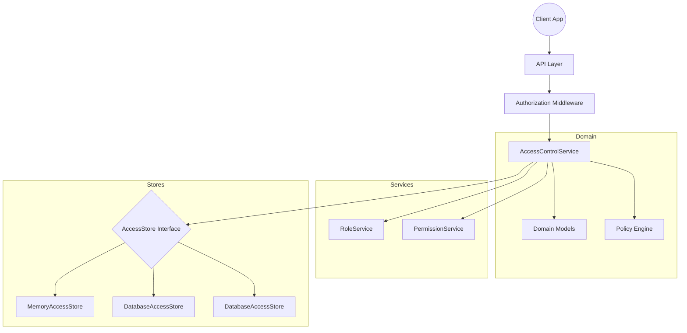

# Architecture

The access control module follows Domain-Driven Design with clear separation between domain logic, application services, and infrastructure adapters.

## High-Level Architecture Diagram



## Architectural Layers

| Layer | Responsibility |
|-------|----------------|
| API Layer | Authorization helpers and middleware |
| Domain Layer | Models, permissions, roles definitions |
| Service Layer | AccessControlService, RoleService, PermissionService |
| Store Layer | Pluggable persistence adapters |
| Policy Layer | Custom authorization rules |

## Permission Model

```
User → has Roles → has Permissions
```

Permission format: `RESOURCE:ACTION`

Examples:
- `USER:READ`
- `USER:UPDATE`
- `POST:DELETE`
- `ORDER:*` (wildcard)

## Data Flow

1. Client requests resource access
2. Middleware extracts user ID
3. AccessControlService evaluates permission
4. Policy engine runs custom rules (if any)
5. Access granted or AuthorizationError thrown
