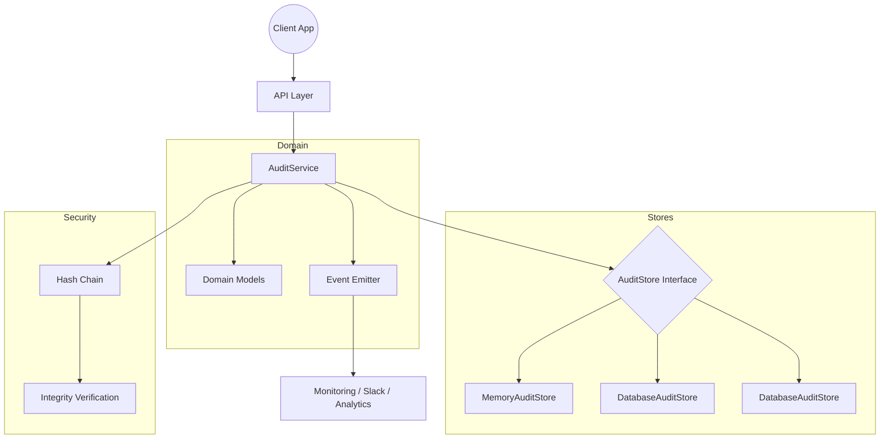

# Architecture

The audit log module follows Domain-Driven Design with clear separation between domain logic, application services, and infrastructure adapters.

## High-Level Architecture Diagram

## Architectural Layers

| Layer | Responsibility |
|-------|----------------|
| API Layer | Convenience functions for common audit actions |
| Domain Layer | Event models, enums, event emitter |
| Service Layer | Orchestration, validation, hash chain |
| Store Layer | Pluggable persistence adapters |
| Security Layer | Tamper detection, append-only enforcement |

## Data Flow

1. Client calls `auditService.log()` with event input
2. Service validates event, attaches context
3. Service computes hash (if enabled) for tamper detection
4. Event is saved to configured store
5. Event is emitted for observability integrations
6. Query operations flow through service to store adapters
