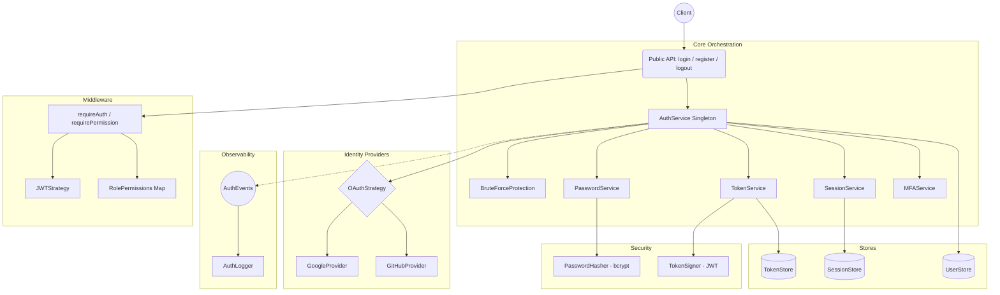

# Architecture

## System Diagram

## Architectural Layers

1. **API Layer (`api/`)** — Thin public wrappers. The only entry point from consuming code.
2. **Service Layer (`services/`)** — All orchestration lives here: `AuthService`, `TokenService`, `SessionService`, `PasswordService`.
3. **Security Layer (`security/`)** — Cryptographic primitives and protection: `PasswordHasher`, `TokenSigner`, `BruteForceProtection`, `MFAService`.
4. **Provider/Strategy Layer (`providers/`, `strategies/`)** — OAuth adapters and JWT extraction strategies.
5. **Store Layer (`stores/`)** — Interface-driven persistence: swap Memory → Prisma → Redis without touching core logic.
6. **Domain Layer (`domain/`)** — Pure TypeScript models, enums, and RBAC maps with zero external dependencies.
