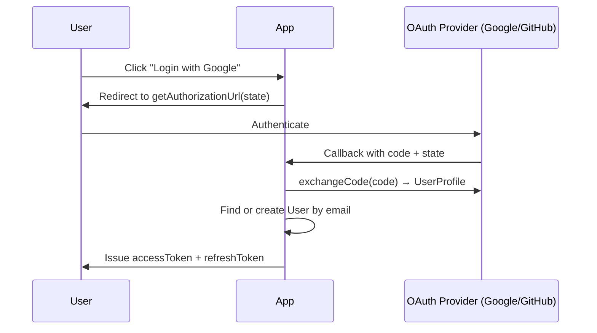

# OAuth Providers

## Provider Interface

```typescript
interface OAuthProvider {
  readonly type: string;
  getAuthorizationUrl(state: string): string;
  exchangeCode(code: string): Promise<UserProfile>;
}
```

Every OAuth provider must implement these three contracts, making them **pluggable adapters**.

## Supported Providers

### Google
Redirects to `accounts.google.com/o/oauth2/v2/auth` with scopes `openid email profile`.

### GitHub
Redirects to `github.com/login/oauth/authorize` with scope `user:email`.

## OAuth Login Flow



## Environment Variables

```env
OAUTH_GOOGLE_CLIENT_ID=...
OAUTH_GOOGLE_SECRET=...
OAUTH_GITHUB_CLIENT_ID=...
OAUTH_GITHUB_SECRET=...
OAUTH_REDIRECT_BASE_URL=https://yourdomain.com
```

## Adding a New Provider

1. Create `providers/MicrosoftProvider.ts` implementing `OAuthProvider`.
2. In `AuthService` constructor: `this.oauthStrategy.register(new MicrosoftProvider())`.
3. No other changes needed — the strategy pattern handles routing automatically.
