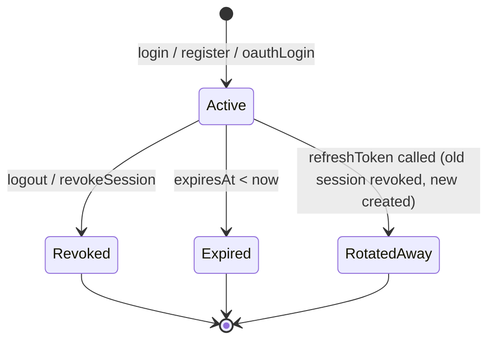

# Session Management

The `SessionService` provides a complete multi-device session lifecycle built on top of the `SessionStore`.

## Session Lifecycle

## Key Operations

| Method | Description |
|--------|-------------|
| `createSession()` | Creates a new session tied to a device (IP + User-Agent) |
| `validateSession()` | Checks expiry and returns session or null |
| `revokeSession()` | Removes a specific session (single logout) |
| `revokeAllSessions()` | Removes all sessions for a user (logout all devices) |
| `getUserSessions()` | Returns safe session metadata without exposing refresh tokens |
| `findByRefreshToken()` | Resolves a session from its refresh token for rotation |

## Multi-Device Support

Each login creates an **independent session**. A user can be logged in from their phone, laptop, and tablet simultaneously. Each issues its own refresh token and session record.

When `logout()` is called with a specific refresh token, only that one device is logged out.

## Security Note

Refresh tokens are stored **as plain UUIDs** in the memory store (demo). In production, **always store a secure hash** of the refresh token in the database and compare against the hash via constant-time comparison.
