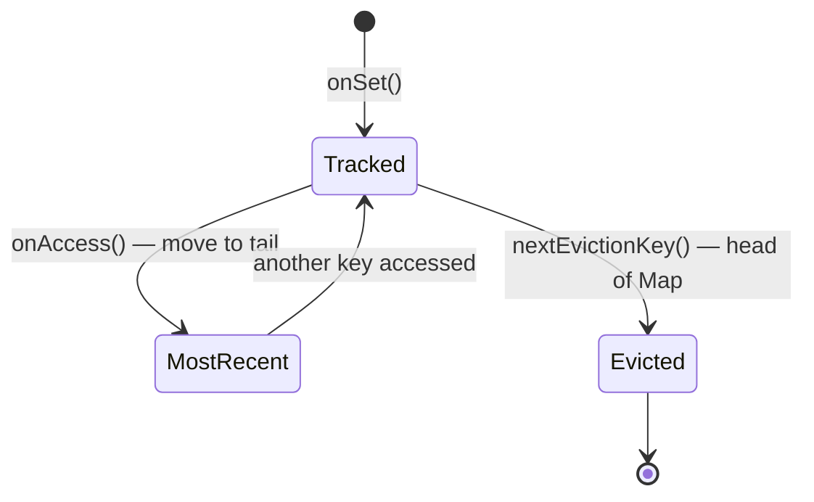

# Eviction Strategies

A `CacheStrategy` determines **when entries are evicted**. Inject a strategy at `CacheService` construction time; swap without touching stores or service logic.

## CacheStrategy Interface

```typescript
interface CacheStrategy {
  shouldEvict(entry: CacheEntry): boolean;
  onAccess(entry: CacheEntry): CacheEntry;
  onSet?(entry: CacheEntry): void;
  nextEvictionKey?(): string | null;
}
```

---

## TTLStrategy

Time-based expiration. Purely stateless — safe for concurrent use.

| Property | Value |
|----------|-------|
| Eviction trigger | `Date.now() >= entry.expiresAt` |
| State | None |
| Immortal entries | `expiresAt === null` → never evicted |
| Clock injection | Pass a custom `nowFn` for deterministic testing |

```typescript
import { CacheService, MemoryStore, TTLStrategy } from '@/features/cache';

const cache = new CacheService({
  stores: [new MemoryStore()],
  strategy: new TTLStrategy(),
});

await cache.set('session', token, { ttl: 1800 }); // expires in 30 min
```

**Testing with a frozen clock:**

```typescript
let fakeNow = Date.now();
const strategy = new TTLStrategy(() => fakeNow);

// advance time programmatically in tests
fakeNow += 2000 * 1000; // fast-forward 2000 seconds
```

---

## LRUCacheStrategy

Least-Recently-Used eviction. Tracks access order in an ordered `Map` (O(1) delete + re-insert).

| Property | Value |
|----------|-------|
| Eviction trigger | Capacity exceeded (size > maxSize) + LRU ordering |
| Also checks TTL | Yes — expired entries are always evicted first |
| State | Internal ordered `Map<key, lastAccessedAt>` |
| `maxSize = 0` | Unlimited — size-based eviction disabled |



```typescript
import { CacheService, MemoryStore, LRUCacheStrategy } from '@/features/cache';

const cache = new CacheService({
  stores: [new MemoryStore()],
  strategy: new LRUCacheStrategy(500), // keep at most 500 entries
});
```

**Trigger manual LRU eviction sweep:**

```typescript
await cache.cleanupLRU(); // evicts entries until size ≤ maxSize
```

---

## Writing a Custom Strategy

```typescript
import type { CacheStrategy } from '@/features/cache';

class NeverEvictStrategy implements CacheStrategy {
  shouldEvict(_entry) { return false; }
  onAccess(entry) { return entry; }
}

const cache = new CacheService({
  stores: [new MemoryStore()],
  strategy: new NeverEvictStrategy(),
});
```
