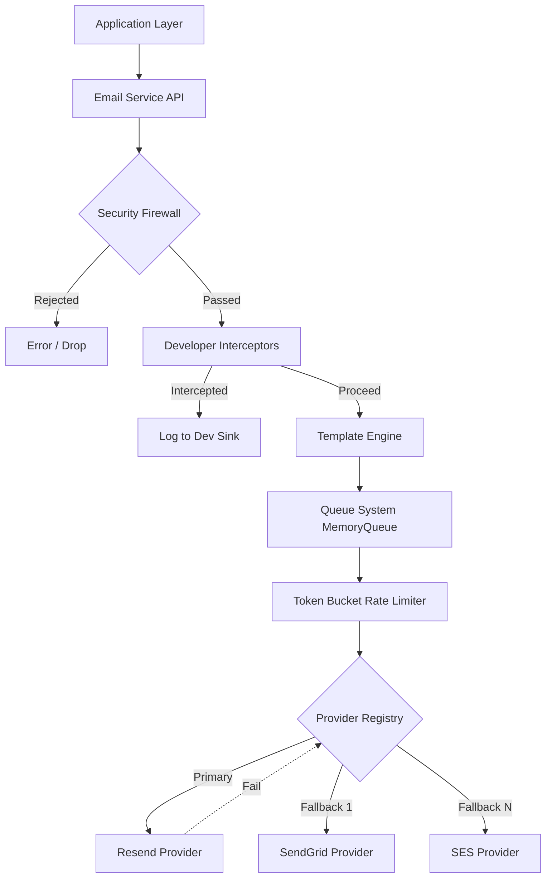

# Architecture

The system is built on Domain-Driven Design (DDD) principles. The architecture guarantees that dependencies point inwards towards the domain models, and outer service integrations (like ESP networks) adapt to the domain.

## High-Level Architecture Diagram

## Components

- **Email Service**: The core orchestrator.
- **Queue Adapter**: Manages egress flow, retries, and asynchronous dispatch.
- **Provider Registry**: Maintains the active and fallback ESP plugins.
- **Template Renderer**: Transforms React-based markup to dual HTML and text.
