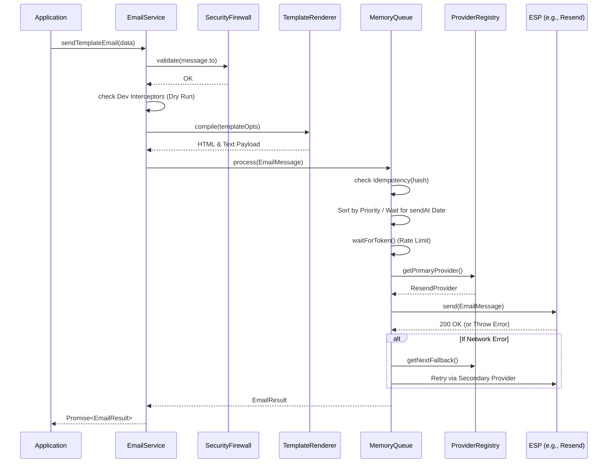

# Email Lifecycle

When an email is dispatched via `sendEmail` or `sendTemplateEmail`, it follows a strict sequence of operations designed for resilience and security.

## Lifecycle Diagram

```mermaid
sequenceDiagram
    participant App as Application
    participant Svc as EmailService
    participant Sec as SecurityFirewall
    participant Rndr as TemplateRenderer
    participant Q as MemoryQueue
    participant Prov as ProviderRegistry
    participant ESP as ESP (e.g., Resend)

    App->>Svc: sendTemplateEmail(data)
    Svc->>Sec: validate(message.to)
    Sec-->>Svc: OK
    Svc->>Svc: check Dev Interceptors (Dry Run)
    Svc->>Rndr: compile(templateOpts)
    Rndr-->>Svc: HTML & Text Payload
    Svc->>Q: process(EmailMessage)
    
    Q->>Q: check Idempotency(hash)
    Q->>Q: Sort by Priority / Wait for sendAt Date
    Q->>Q: waitForToken() (Rate Limit)
    
    Q->>Prov: getPrimaryProvider()
    Prov-->>Q: ResendProvider
    
    Q->>ESP: send(EmailMessage)
    ESP-->>Q: 200 OK (or Throw Error)
    
    alt If Network Error
        Q->>Prov: getNextFallback()
        Q->>ESP: Retry via Secondary Provider
    end

    Q-->>Svc: EmailResult
    Svc-->>App: Promise<EmailResult>
```
