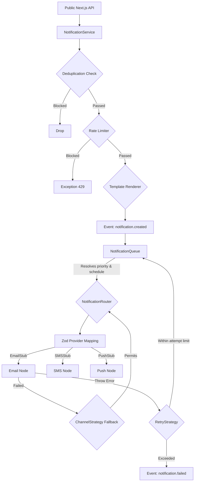

# Architecture

The notification system follows Domain-Driven Design principles with clear separation between domain logic, application services, and infrastructure adapters.

## High-Level Flow

## Components

| Component | Responsibility |
|-----------|----------------|
| `NotificationService` | Entry point, validates and dispatches notifications |
| `DeduplicationCheck` | Prevents duplicate deliveries using message ID |
| `RateLimiter` | Enforces per-user rate limits |
| `NotificationQueue` | Manages async processing and priority |
| `NotificationRouter` | Routes to appropriate provider adapter |
| `RetryStrategy` | Handles failed delivery retries with exponential backoff |
