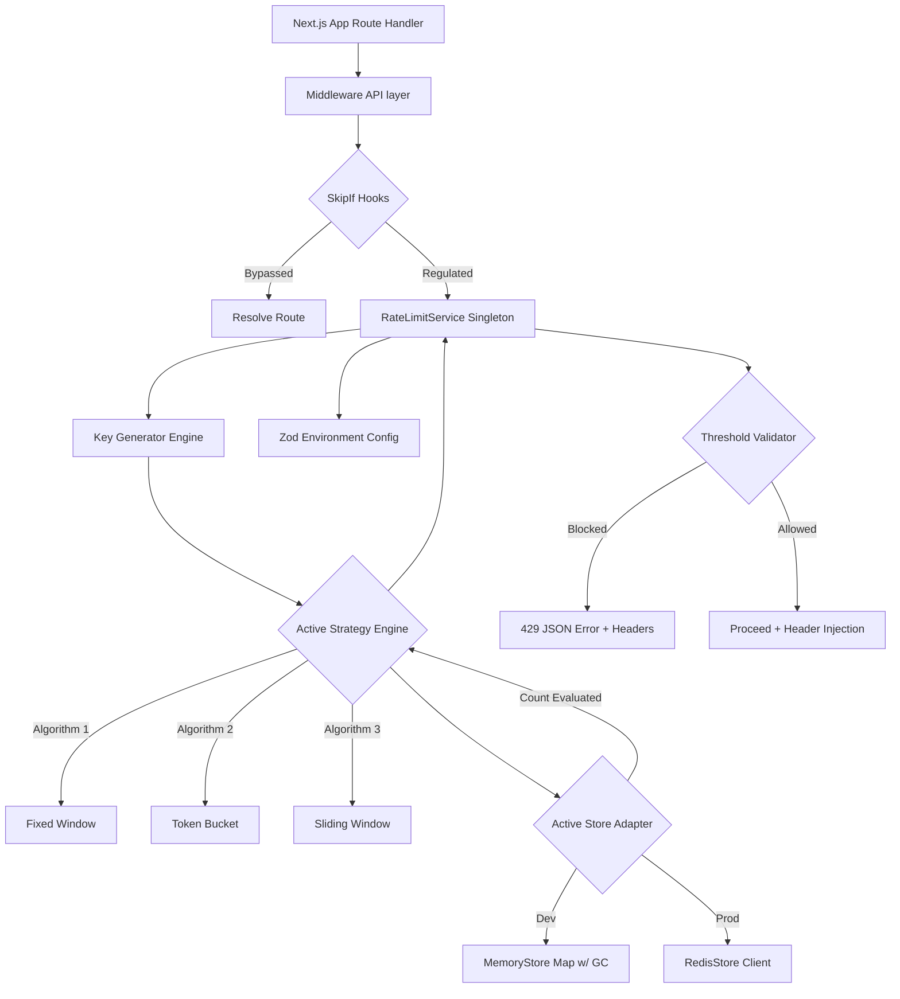

# Architecture

The rate limiter follows Feature-Based Domain-Driven Design principles with clear separation between configuration, core service, strategy, and storage layers.

## High-Level Architecture Diagram

## System Components

| Layer | Responsibility |
|-------|----------------|
| Configuration Layer | Validates env vars with Zod, provides defaults |
| Core Service | Central hub for rule retrieval and key mapping |
| Algorithm Layer | Implements throttling mathematics |
| Storage Layer | Persistence (Memory or Redis) |

## Data Flow

1. Request hits middleware
2. Check skip conditions (bypass hooks)
3. Generate rate limit key
4. Apply strategy algorithm
5. Query storage for current count
6. Validate against limit
7. Return 429 or proceed
