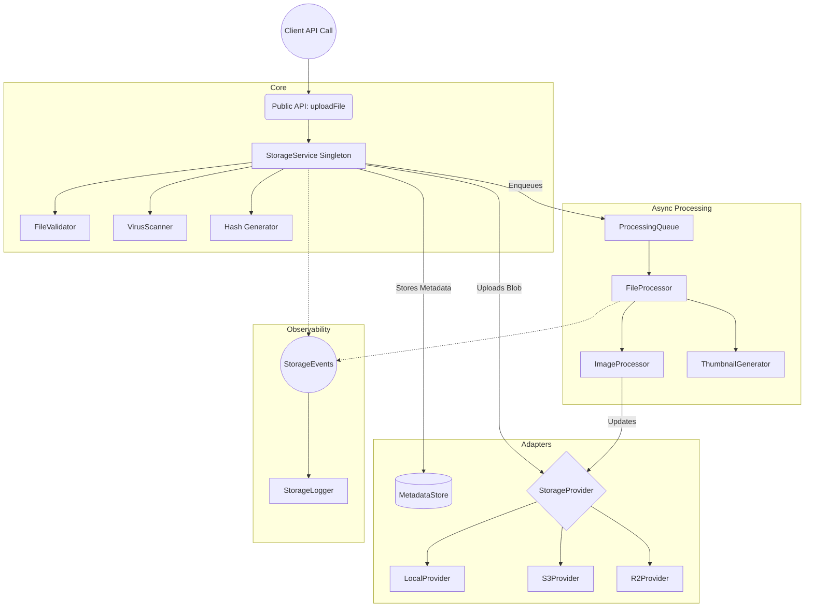

# Architecture

The system follows a strict layered architecture pattern.

## Diagram

## Layers

1. **API Layer (`src/features/storage/api/`)**: Extremely thin wrappers around the `StorageService`. Provides the public boundary.
2. **Service Layer (`src/features/storage/services/`)**: Orchestrates the workflow. Validates the file, calculates hashes, pushes to the provider, saves metadata, and enqueues jobs.
3. **Provider Layer (`src/features/storage/providers/`)**: The physical adapters connecting to real-world infrastructure (Disk, S3, R2).
4. **Processing Layer (`src/features/storage/transforms/`)**: Dedicated classes for manipulating buffers (e.g., resizing images).
