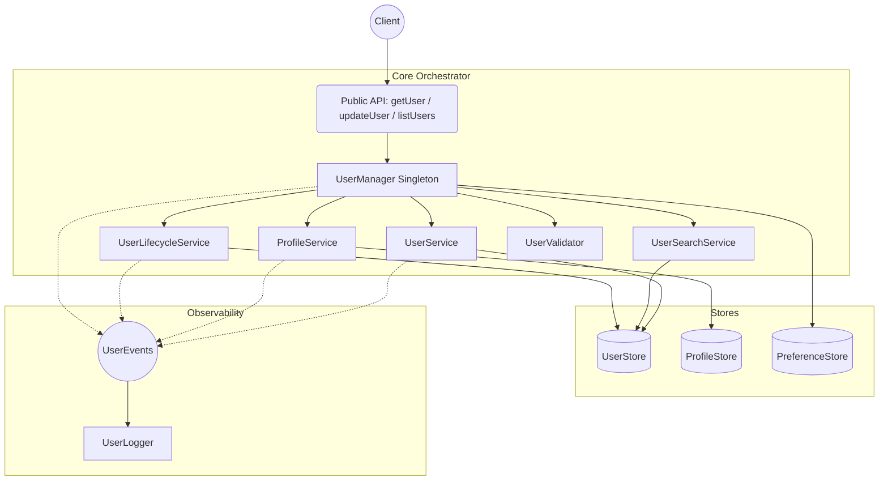

# Architecture

## System Diagram

## Architectural Layers

1. **API Layer (`api/`)** — Thin, stateless public function wrappers.
2. **Orchestration Layer (`services/UserManager.ts`)** — The singleton entry point. Wires all stores + services and exposes clean compound operations.
3. **Service Layer (`services/`)** — Focused service classes: `UserService`, `ProfileService`, `UserSearchService`, `UserLifecycleService`.
4. **Validation Layer (`validation/`)** — `UserValidator` runs Zod checks before any mutation.
5. **Store Layer (`stores/`)** — Interface-driven persistence (currently in-memory; production swap to Prisma/Redis).
6. **Domain Layer (`domain/`)** — Pure models, enums, and RBAC maps with zero dependencies.
