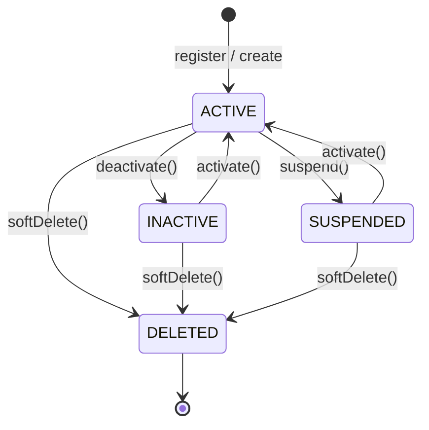

# User Lifecycle

The `UserLifecycleService` manages all status transitions using a **transition graph** to prevent invalid moves.

## Status States



## Transition Rules

| From | Allowed Transitions |
|------|---------------------|
| `ACTIVE` | `INACTIVE`, `SUSPENDED`, `DELETED` |
| `INACTIVE` | `ACTIVE`, `DELETED` |
| `SUSPENDED` | `ACTIVE`, `DELETED` |
| `DELETED` | *(none — terminal state)* |

Attempting an unauthorized transition throws `InvalidStatusTransitionError`.

## Available Operations

```typescript
import { UserManager } from "@/features/user";

const mgr = UserManager.getInstance();

await mgr.lifecycle.activate("user-id", "admin-id");
await mgr.lifecycle.deactivate("user-id", "admin-id");
await mgr.lifecycle.suspend("user-id", "admin-id");
await mgr.lifecycle.softDelete("user-id", "admin-id");
```

## Soft Delete Guarantee

Deleting a user **never removes the database record**. It sets `status = DELETED`. This prevents accidental data loss and supports audit trails. A separate data retention job can physically purge records on a schedule if needed.
